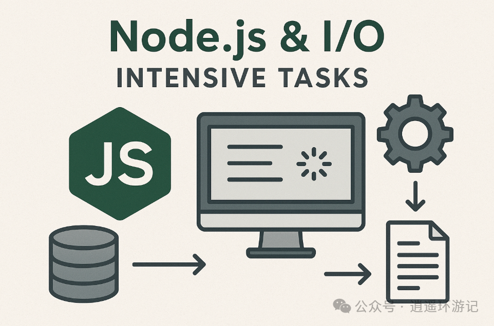

### Node.js 为什么更适合 I/O 密集型任务？



Node.js 为什么以及如何在 I/O 密集型任务上表现卓越。这要从其最核心的 “事件循环” 和 “非阻塞 I/O” 模型说起。

## 一、核心理念：把等待时间利用起来

想象一个餐厅：

- 传统多线程餐厅（如 Apache, Java）：一个客人（请求）进来，就分配一个服务员（线程）全程服务。服务员点完单后，站在厨房门口干等厨师做菜。即使有其他客人招手，这个服务员也不能离开。如果客人很多，餐厅就要雇很多服务员（创建大量线程），大部分时间他们都在等待，工资（内存和 CPU 上下文切换开销）却照付。

- Node.js 餐厅（事件循环）：只有一个超级服务员（事件循环线程）。客人点完单后，他把单子交给厨房（发起一个异步 I/O 请求），然后立刻转身去服务下一桌客人。厨房做好菜后，按铃通知（事件触发），超级服务员再把菜端上去（执行回调函数）。

关键区别：Node.js 的服务员在等待时，不是在发呆，而是在服务其他人。


## 二、技术架构拆解

1. 单线程事件循环：大脑指挥官

Node.js 只有一个主线程（事件循环线程）。它不做繁重的计算或实际的 I/O 操作，只负责两件事：

- **调度**：查看有哪些任务（回调函数）可以执行了

- **执行**：运行这些任务（JavaScript 代码）

这个循环是**非阻塞的**。当一个网络请求、文件读取或数据库查询发起后，事件循环不会等待结果，而是立即去检查并执行下一个可执行的任务。

```code

// 伪代码演示事件循环如何工作

while (eventLoop.isAlive) {    
    // 1. 检查计时器（setTimeout, setInterval）    
    // 2. 检查待处理的回调（如已完成I/O的回调）    
    // 3. 检查闲置阶段（setImmediate）    
    // 4. 检查轮询阶段（检索新的I/O事件）    
    // ... 不断循环
}

```

2. 异步与非阻塞 I/O：高效执行者

当 JavaScript 代码调用一个异步API（如 `fs.readFile`, `http.request`），会发生什么？

```code

const fs = require('fs');
console.log('1. 开始读取文件'); // 同步，立即执行

fs.readFile('/large.txt', (err, data) => {    
    // 这是回调函数，在未来某个时间点执行      
    console.log('3. 文件读取完成');
});

console.log('2. 可以做其他事了'); // 同步，立即执行

// 输出顺序：1 -> 2 -> 3

```

幕后流程：
  - 主线程执行 fs.readFile，这个调用被交给Node.js底层的C++线程池（libuv库管理）去执行真正的文件读取。
  - 主线程立即得到返回，继续执行下一行代码 console.log('2. ...')。

  - 线程池中的某个工作线程在操作系统级别进行（可能很慢的）文件 I/O。

  - I/O 完成后，工作线程将结果和回调函数包装成一个事件，放入一个队列中。

  - 事件循环在下一个循环的某个阶段，从队列里取出这个事件，并在主线程上执行对应的回调函数 (err, data) => {...}。

___
__所以，Node.js看似是“单线程”，实则背后有强大的多线程线程池（`libuv`）支撑着所有耗时的 I/O 操作。 主线程只负责快速的JavaScript执行和回调调度。__
___

3. 适合 I/O 密集型的本质原因

I/O 密集型任务（网络请求、数据库查询、文件读写）的**主要耗时不在 CPU 计算，而在等待外部系统的响应**。

  - CPU 时间极短：解析一个 HTTP 请求、构建一个 JSON 对象，只需要几毫秒的 CPU 时间。

  - 等待时间极长：等待数据库返回结果可能需要几十到几百毫秒。

Node.js 的模型完美匹配这种场景：
  - 用廉价的（内存开销小）方式发起大量 I/O 请求：每个并发连接在 Node.js 中只是一个JavaScript 对象和一个待处理的回调，开销极小（约KB级别），而一个传统线程栈需要 MB级别。

  - 在漫长的 I/O 等待期，不占用任何 CPU 资源：线程池的工作线程在操作系统层面阻塞等待，而主线程（事件循环）是空闲的，可以去处理其他已经准备好的 I/O 结果。

  - 高并发下的稳定性能：在面对成千上万的并发连接（如聊天室、实时通知系统）时，Node.js 只需增加少量内存来维护连接状态，而传统多线程模型会因线程数量爆炸（线程创建、销毁、切换开销巨大）而性能骤降或崩溃。

## 三、与 CPU 密集型任务的对比（Node.js 的软肋）

```code

// CPU密集型任务示例：计算斐波那契数列
app.get('/fibonacci/:n', (req, res) => {    
    const n = parseInt(req.params.n);    
    const result = fib(n); // 一个非常耗时的同步计算函数   
    res.send({ result });
});

function fib(n) {    
    if (n <= 1) return n;    
    return fib(n - 1) + fib(n - 2); // 递归计算，完全占用CPU
}

```
问题：计算 `fib(40)` 可能需要几秒钟。在这几秒内，事件循环**被完全阻塞**，无法处理任何其他请求，整个服务器如同“死机”。

1. 为什么不适合 CPU 密集型任务
    - 事件循环的优势在于“在 I/O 等待时做别的事”。但 CPU 计算没有“等待”，它需要持续占用 CPU。

    - 单线程意味着所有计算任务必须排队。一个重计算任务会饿死所有其他请求。
      - CPU 密集型任务会阻塞所有异步任务
      - 阻塞发生在回调执行阶段，而不是异步操作发起阶段
      - 定时器、I/O 回调、Promise 都会被延迟

正常情况：I/O 密集型

```code

时间线：0ms         10ms        20ms        30ms        40ms
请求A: [发起I/O请求]             [回调执行1ms]
请求B:             [发起I/O请求]            [回调执行1ms]
请求C:                       [发起I/O请求]              [回调执行1ms]
事件循环: █████████████████████████████████████████████████████████

```
阻塞情况：回调中有 CPU 计算

```code

时间线：0ms         10ms        20ms        30ms        40ms
请求A: [发起I/O请求]             [回调执行█████████15ms]
请求B:            [发起I/O请求]  等待...等待...等待...  [回调被延迟]
请求C:                       [发起I/O请求] 等待...等待...等待... [回调被延迟]
事件循环: ██████████████████████████████被阻塞15ms████████████████████████

```

简单比喻：

Node.js的事件循环就像一个单线道的收费站。CPU密集型任务就像一辆大卡车，通过需要很长时间。在此期间，后面所有车（异步任务）都必须等待，无论它们多么简单快速

2. 如何检测阻塞

```code

// 使用监控工具检测事件循环延迟
const monitor = require('event-loop-lag');

const lag = monitor();

setInterval(() => {    
        console.log(`事件循环延迟: ${lag()}ms`);    
        // 如果经常 > 100ms，说明有阻塞
}, 100);

```

解决方案：
  - 使用 Worker Threads 将计算任务丢给其他线程。
  - 将 CPU 密集型服务拆分为单独的微服务（如用 Go、Python 编写）。


## 四、理解 Node.js 线程

  1. Node.js 与传统服务器架构的核心区别
```code

// 传统：Apache（多线程） vs Node.js（单线程）
Apache:  [线程1] [线程2] [线程3] [线程4] ... (每个线程处理一个连接)

Node.js: [单个事件循环线程] + [线程池处理I/O]         

          ↑   

      处理所有连接

```

| 特性            | 传统多线程模型    | Node.js 事件驱动 |
| :-------------  | :------------- | :-------------  |
| 并发模型         | 一个请求一个线程  |  单线程 + 事件循环 |
| 内存使用         | 高（每个线程需要独立内存）  |  低（共享内存） |
| CPU利用率         | I/O 时线程闲置  |  I/O 时处理其他任务 |
| 状态管理         | 通常无状态，依赖外部存储  |  可在内存中保持状态 |
| 适用场景         | CPU密集型计算  |  I/O密集型应用 |

2. 底层架构：libuv 线程池的工作方式

`libuv` 是 Node.js 的跨平台异步 I/O 库，它维护了一个固定大小的线程池（默认4个线程），用于执行无法异步完成的阻塞操作。这个线程池是 Node.js 能够处理高并发 I/O 的关键。

```code

// 查看线程池大小
process.env.UV_THREADPOOL_SIZE // 默认值：4

// 可以通过环境变量调整
UV_THREADPOOL_SIZE=8 node server.js

// 或者在代码中设置（必须在所有I/O操作之前）
process.env.UV_THREADPOOL_SIZE = 12; // 可配置最多1024个

// 经验法则：
// 1. I/O密集型：线程数 = CPU核心数 * 2
// 2. 计算密集型：线程数 = CPU核心数 + 1
// 3. 考虑内存：每个线程约1MB栈空间

```

模拟 libuv 线程池的工作方式：

```code

class ThreadPoolSimulator {
    constructor(size = 4) {
        this.threadPool = new Array(size).fill(null).map(() => ({
            busy: false,
            id: Math.random().toString(36).substr(2, 9)
        }));
        this.taskQueue = [];
        this.callbackQueue = [];
    }

    // 模拟异步I/O调用
    submitTask(task, callback) {
        console.log(`[主线程] 提交任务:${task.type}`);
        const availableThread = this.threadPool.find(t => !t.busy);

        if (availableThread) {
            this.executeInThread(availableThread, task, callback);
        } else {
            console.log(`[线程池] 所有线程忙，任务进入队列等待`);
            this.taskQueue.push({task, callback});
        }

    }

    executeInThread(thread, task, callback) {
        thread.busy = true;
        console.log(`[线程${thread.id}] 开始执行:${task.type}`);
        // 模拟线程中执行阻塞I/O
        setTimeout(() => {
            console.log(`[线程${thread.id}] 完成:${task.type}`);
            thread.busy = false;
            // 将回调放入队列，等待事件循环执行
            this.callbackQueue.push({result: `结果:${task.type}`, callback: callback});
            // 检查是否有等待的任务
            if (this.taskQueue.length > 0) {
                const next = this.taskQueue.shift();
                this.executeInThread(thread, next.task, next.callback);
            }
        }, task.duration);
    }

    // 事件循环处理回调
    processCallbacks() {
        while (this.callbackQueue.length > 0) {
            const item = this.callbackQueue.shift();
            console.log(`[事件循环] 执行回调:${item.result}`);
            item.callback(null, item.result);
        }
    }
}

// 使用模拟器
const pool = new ThreadPoolSimulator(2);// 2个线程

// 提交多个文件读取任务
for (let i = 1; i <= 5; i++) {
    pool.submitTask({type: `读取文件${i}.txt`, duration: 1000 + Math.random() * 500}, (err, result) => {
            console.log(`[回调]${result}完成`);
        }
    );
}
// 模拟事件循环
setInterval(() => pool.processCallbacks(), 100);


```


使用线程池的操作，如：
  - 文件系统操作（除了 fs.watch）

  - DNS查询（除了dns.lookup 使用 getaddrinfo）

  - 加密操作（部分）

  - 压缩/解压

不使用线程池的操作，如：
  - 网络 I/O（由操作系统直接提供异步支持）

  - TCP/UDP

  - 定时器


3. 串行 or 并行？

总结要点：
- libuv 线程池是真正并行的：

  - 每个线程独立运行

  - 不同线程间可并行处理不同任务

- 并行度受线程数量限制：默认4线程 = 最多4个任务同时执行

- 依赖操作系统进行线程调度：libuv 让操作系统处理任务切换，更高效

- 队列 vs 执行：任务队列是串行的 FIFO，但由不同线程并行执行

- 回调执行是串行的：回调函数在主线程事件循环中串行执行

简单记忆：

  - 线程池内：任务执行 → 并行

  - 主线程内：回调执行 → 串行

  - 任务队列：任务排队 → 串行 FIFO


```code

const fs = require('fs');
console.log('1. 主线程开始');// ← 在主线程执行
// 异步读取文件
fs.readFile('/large.txt', (err, data) => {
    // 这个回调在主线程执行
    console.log('3. 回调在主线程执行');
});

console.log('2. 主线程继续');// ← 在主线程执行
// 具体流程：
// 1. 主线程执行 fs.readFile() 调用
// 2. libuv 将任务提交到线程池队列
// 3. 某个工作线程从队列获取任务
// 4. 工作线程执行：os.readFileSync(filename) ← 这里阻塞！
// 5. 工作线程阻塞等待磁盘I/O完成
// 6. I/O完成后，工作线程将回调放入事件队列
// 7. 主线程在下一个事件循环中执行回调

```

4. 线程池干扰

  `libuv` 线程池中的线程会相互干扰，但不是通过直接的线程阻塞。多个线程竞争，会造成性能下降。

根本原因:

    - 资源竞争：CPU时间、磁盘I/O、内存带宽、文件锁

    - 排队延迟：当活动线程数超过线程池大小时，任务必须等待

    - 系统级竞争：操作系统资源调度的影响

干扰分层：

```code

应用层干扰（任务排队）     
    ↓
线程池层干扰（线程竞争）     
    ↓
操作系统层干扰（CPU调度、内存管理）     
    ↓
硬件层干扰（CPU缓存、磁盘寻道）

```

优化策略：
  - ✅ 监控：了解干扰模式和程度，增加监控和报警

  - ✅ 分离：关键任务使用专用资源

  - ✅ 优先级：确保重要任务优先

  - ✅ 批量：减少任务切换开销

  - ✅ 限流：防止过载导致的级联干扰


5. 与 Worker Threads 的区别

    Worker Threads 和 libuv 线程池是完全独立的两个线程系统，互不影响。

差异对比：

| 特性     | libuv 线程池     | Worker Threads |
| :------------- | :------------- | :------------- |
| 线程数量  | 固定（默认4，可配置）     | 动态（用户创建）          |
| 线程寿命  | 任务型，复用     | 持久，直到显式终止          |
| 执行内容  | C++ 系统调用     | 完整 JavaScript 环境          |
| 内存隔离  | 共享进程内存     | 独立堆、独立 V8 实例          |
| 通信方式  | 通过事件队列     | MessageChannel、共享内存          |
| 创建者  | libuv 自动创建     | 用户显式创建         |
| 用途  | 内部 I/O 操作     | CPU 密集型计算、隔离任务          |

总结要点：
Worker Threads 不会使用 libuv 线程池的线程，因为：

  - 完全独立的 V8 实例：每个 Worker 有自己完整的 JavaScript 环境

  - 独立的 libuv 线程池：每个 Worker 有自己的 libuv 线程池（默认也是4个）

  - 操作系统级线程：Worker 是真正的操作系统线程

  - 持久存在：Worker 一直运行直到显式终止

  - 资源隔离：独立内存堆、独立事件循环、独立错误处理


使用说明：

```code

// 创建Worker时：
const worker = new Worker('./my-worker.js');

// 实际发生：

// 1.操作系统创建新线程 ← 新线程，不是从libuv池取的！

// 2.在新线程中初始化新的V8实例3

// 3.新V8实例有自己的libuv线程池  ← 新的libuv池，4个线程

// 4.加载并执行Worker脚本

// 5.Worker与主线程通过消息通信


// 所以：
// 1个Worker = 1个OS线程 + 1个V8实例 + 1个libuv线程池(4线程)
// 总共增加：5个线程（1个Worker线程 + 4个libuv工作线程）

```

```code

// ✅ 正确使用Worker：

1.CPU密集型计算（图像处理、科学计算）

2.阻塞操作隔离（同步API调用）

3.内存隔离需求（大数据处理）

4.错误隔离（可能崩溃的任务）


// ❌ 不适合用Worker：

1.简单I/O操作（用async/await + libuv线程池）

2.大量小任务（线程创建开销大）

3.需要频繁通信的任务（序列化开销大）

4.内存敏感场景（每个Worker占用10-30MB内存）
// 📊 配置建议：

- Worker数量 ≈ CPU核心数

- 每个Worker内，UV_THREADPOOL_SIZE根据任务类型配置

- 使用Worker池复用Worker，避免频繁创建销毁

- 监控Worker内存使用和生命周期

```


## 五、总结：Node.js 的适用场景

| 非常适合 (I/O 密集型)    | 不太适合 (需要额外处理)     |
| :------------- | :------------- |
| API服务器 / BFF层：频繁调用下游微服务、数据库。    | 图像/视频处理：大量像素计算。       |
| 实时应用：聊天、协作工具、游戏服务器（WebSocket）。 | 复杂数学计算/机器学习推理。       |
| 数据流应用：代理、网关、实时数据管道。    | 大规模数据排序/转换（同步进行时）。       |
| CLI工具 / 构建工具：涉及大量文件操作。    | 区块链挖矿（纯计算）。       |
| SSR (服务器端渲染)：主要耗时在数据获取和模板拼接。    | 区块链挖矿（纯计算）。       |

**一句话总结**：Node.js 通过 “**单线程事件循环** + **底层多线程 I/O 池**” 的架构，将昂贵的线程等待时间转化为处理其他请求的机会，用极小的资源开销支撑极高的 I/O 并发，这正是其擅长 I/O 密集型任务的 **根本原因**。对于 CPU 密集型任务，它需要借助其他多线程机制来弥补短板。
