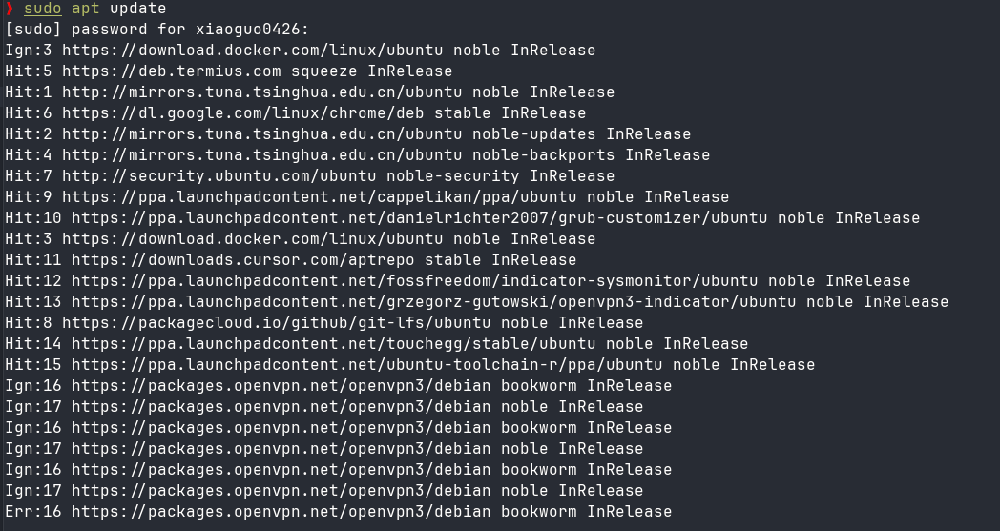
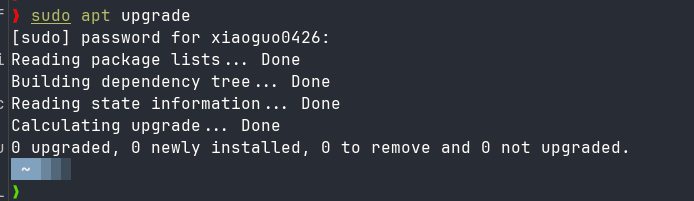
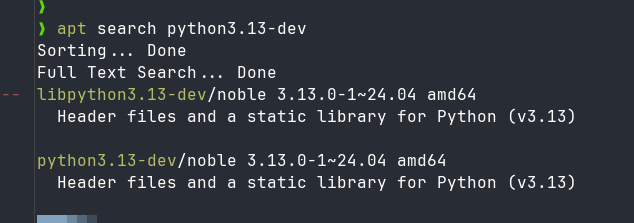
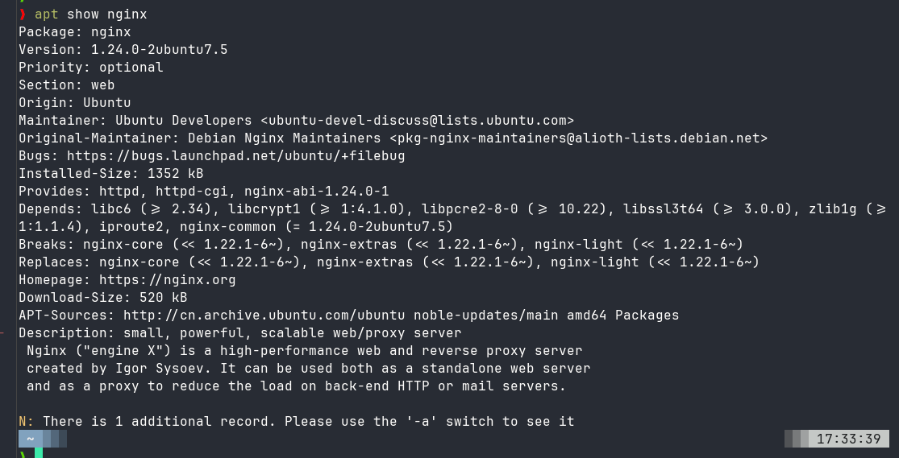
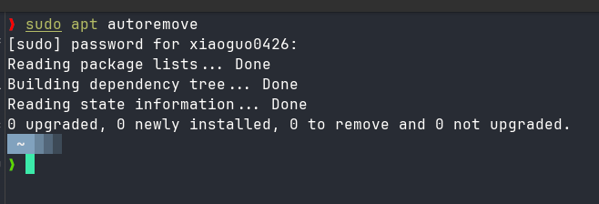

APT 是 Debian 系发行版的高级包管理工具，建立在底层的 `dpkg`（Debian Package Manager）之上。它能够自动处理软件包之间的依赖关系，从配置好的软件源（repositories）中下载并安装所需软件，避免了手动解决依赖冲突的繁琐过程。APT 支持通过网络仓库在线安装软件，也支持本地 .deb 包的管理。

与早期的 `apt-get` 和 `apt-cache` 相比，现代 Linux 系统推荐使用更简洁直观的 `apt` 命令（自 Ubuntu 16.04 起成为默认），它整合了常用功能，并优化了输出格式，更适合日常交互式使用。


### 基本用法

> 1. 更新软件包列表

在安装或升级软件前，应先同步本地包索引与远程仓库：

```
sudo apt update

```




若需更彻底的升级（包括自动处理依赖变化、安装新包或删除旧包），可使用：

> 2. 升级已安装的软件包

更新所有可升级的软件包（不删除旧包，也不安装新依赖）：

```
sudo apt full-upgrade

```



> 注意：upgrade 更保守，适合日常维护；full-upgrade 类似于旧版的 dist-upgrade，适用于大版本更新。

> 3. 安装软件包

安装指定软件（如 vim）：

```
sudo apt install vim

```

APT 会自动解析并安装所有依赖项。若需同时安装多个软件，可一次列出：

```
sudo apt install git curl wget

```

> 4. 删除软件包

仅删除软件本身，保留配置文件：

```
sudo apt remove firefox
```

若要彻底清除软件及其配置文件（类似“卸载干净”）：

```
sudo apt purge firefox
```

> 5. 搜索软件包

在仓库中搜索包含关键词的软件包：
```
apt search python3
```


查看某软件包的详细信息（版本、描述、依赖等）：

```
apt show nginx
```



> 6. 清理无用包

系统长期使用后可能残留无用的依赖包（即“孤儿包”）。可使用以下命令清理：

```
sudo apt autoremove
```



此外，还可清理已下载的 .deb 安装包缓存（位于 /var/cache/apt/archives/）：

```
sudo apt clean        # 完全清空缓存
sudo apt autoclean    # 仅删除过期版本的缓存

```
